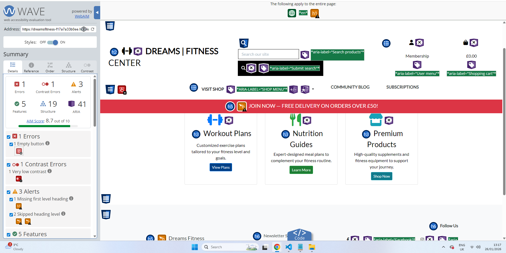
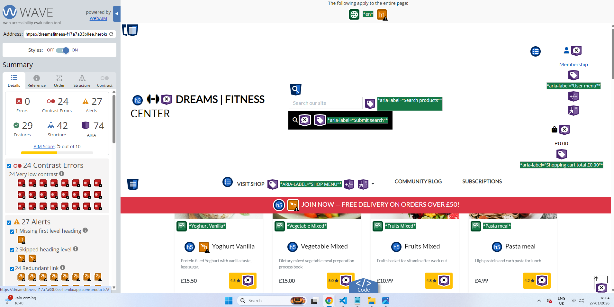
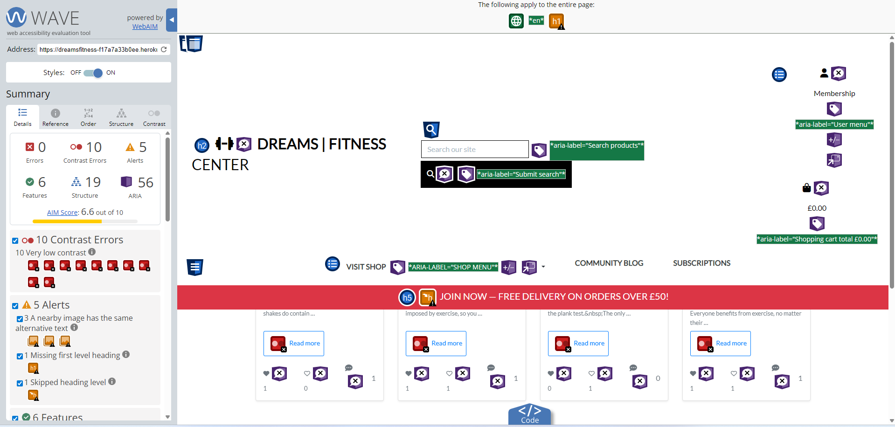
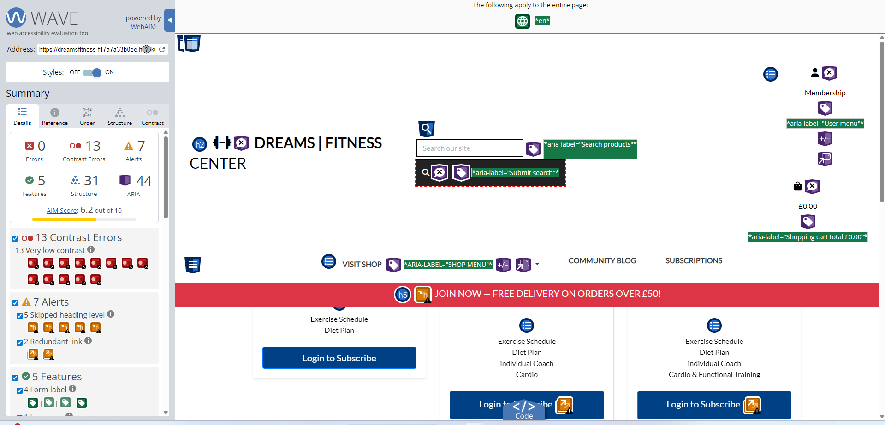
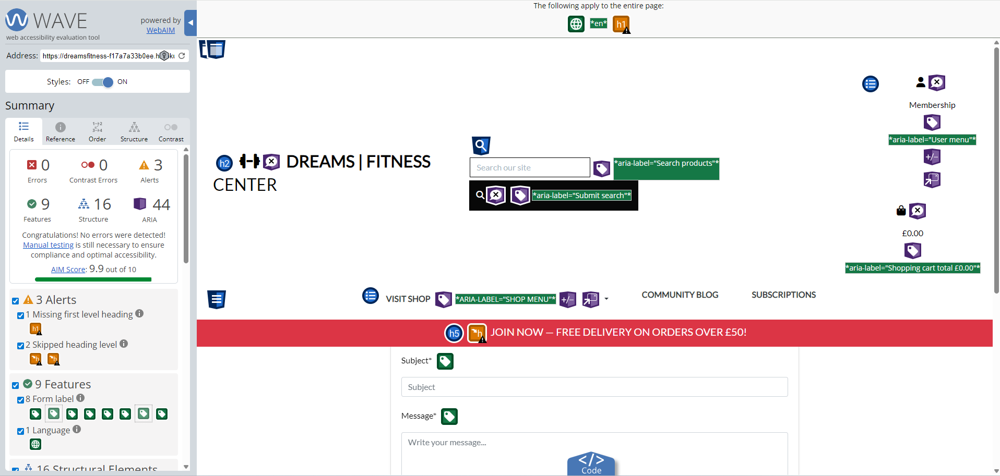
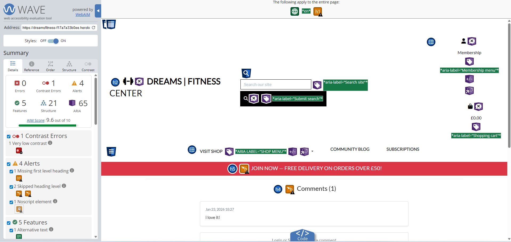
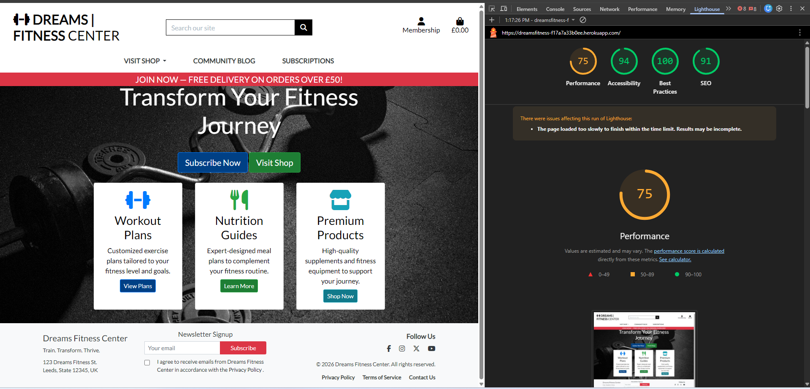
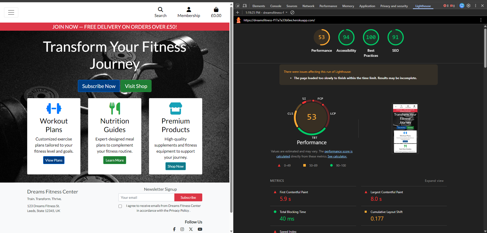
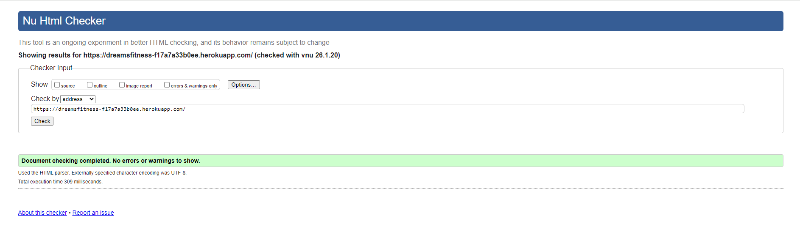
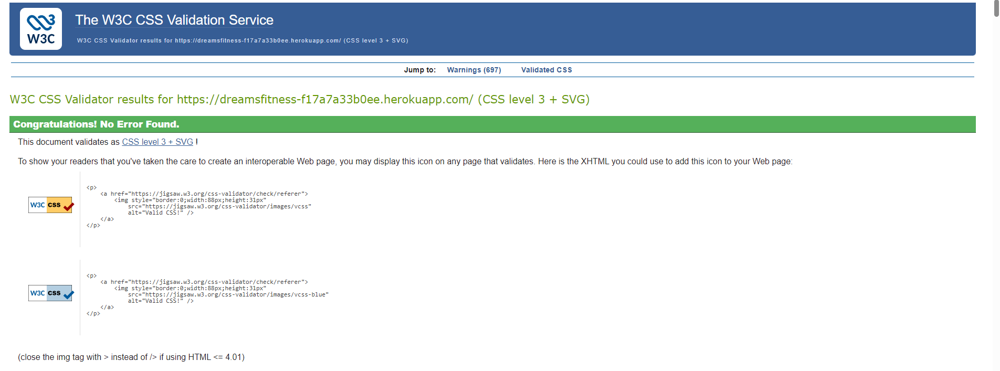

# Testing Documentation

## Overview
Manual testing was conducted to ensure correct functionality, security, and responsiveness across the application.

## Manual Testing
 | Feature | Test  | Expected Result | Actual Result |
| -------------| ----- | ----- | :----: |
| DREAMS FITNESS CENTER  | Selecting logo on homepage |  directs user back to homepage |  Pass |
| Search | Using the search box | Entering a search returns expected result  |  Pass |
| Search no results | No search | Entering a no results search returns error message and shows all products  |  Pass |
| Navigation Links  | Selecting navigation links |  directs user to relevant pages |  Pass |
| Catalog  | Selecting atalog |  directs user to all products |  Pass |
| Back to top | Back to top arrow | Select the arrow box on the products page brings the user back to the top of the page  |  Pass |
| Sort By  | Selecting the filter Sort |  successfully sort by price, name and category options |  Pass |
| Visit Shop button  | Selecting Visit Shop button |  directs user to Catalog page |  Pass |
| Subscribe Now button  | Subscribe Now button |  directs user to Subscription plans page |  Pass |
| Workout Plans | Selecting View Plans |  directs user to Subscription plans page |  Pass |
| Nutrition Guides | Selecting Learn more |  directs user to Nutrition Guides page |  Pass |
| Premium Products | Selecting Shop Now |  directs user to Catalog page |  Pass |
| Sign up for our newsletter | selecting Sign up for our newsletter |  directs user Sign up for our newsletter page |  Pass |
| Privacy policy | Selecting privacy policy |  directs user to privacy policy|  Pass |
| facebook icon | Selecting  facebook icon |  directs user to facebook page |  Pass |
| Special offers | Selecting all specials |  directs user to all special offers |  Pass |
| Community Blog | Selecting Community blog |  directs user to blog page |  Pass |
| Blog detail | Selecting Blog detail |  directs user to blog detail |  Pass |
| Leave a Comment when signed in | Submitting comment|  successfully submit and display comment |  Pass |
| Create Post | Creating a new post | successfully add new blog to blog page  |  Pass |
| As Admin edit blog | editing blog|  successfully edited the blog |  Pass |
| As Admin Delete Comment | Deleting comment|  successfully remove comment |  Pass |
| Contact | Selecting Contact | directs user to contact page  |  Pass |
| Contact form submission | submitting contact form | successfully sends submit form and can seen be in admin |  Pass |
|Membership | Login as admin | displays dropdown menu with dashboard to admin and profile to auntenticated login user and logout  |  Pass |
| Add product | Adding a new product| successfully add new product to products page  |  Pass |
| Add Product | no image is selected | default image is used |  Pass |
| As Admin edit product | editing product |  successfully edited the product |  Pass |
| As Admin Delete product | Deleting product|  successfully remove product |  Pass |
| Register | Register for an account | selecting Register in my account directs user signup page |  Pass |
| Register | Registering as a new user | Registering as a new user form works |  Pass |
| Login | Login to an account | selecting Login in my account directs user to Login page |  Pass |
| Login | Login to an account | login-in as a new user form works |  Pass |
| Login as admin| Login to as admin gives access to blog/product management | login-in as a new user form works |  Pass |
| Logout | message shown | Logging out message shown |  Pass |

---

## Wave testing

I also tested this site on [WAVE Web Accessibility Evaluation Tool](https://wave.webaim.org/) is a set of evaluation tools which helps authors to make their web content more accessible to individuals with disabilities. WAVE can identify many accessibility and Web Content Accessibility Guideline (WCAG) errors, but also facilitates human evaluation of web content as per definition on their site.

  
Home

  

  I went on to fix the error by adding the missing navbar toggler button to the Mobile navigation and label to the search.

 

Vist Shop - Catalog

 

Community Blog

Fixed the alerts by adding buttons to Visit Shop and Subscription

 

Subscription

 

  
Contact us

  

  changed the level heading. Skipped the labels part as I had no intention to use labels on this page

 

  
Blog detail

 

---

 

  
Click here for Lighthouse results

 Desktop

  

Mobile

  
 
  
 

---

  

  
Click here for Markup results

   

  
 

  

  
Click here for CSS results 

  

  
 

---

### Python
[ CI Python linter ](https://pep8ci.herokuapp.com/) was used to test python code

---

## Authentication & Authorisation Testing

| Test Case | Expected Result | Outcome |
|----------|----------------|---------|
| User login | Redirect to profile | Pass |
| Superuser login | Redirect to dashboard | Pass |
| Unauthenticated profile access | Redirect to login | Pass |

---

## Navigation Testing

| Feature | Outcome |
|--------|---------|
| Role-based navbar | Pass |
| Mobile navigation | Pass |
| Logout functionality | Pass |

---

## Checkout & Payments

| Feature | Outcome |
|--------|---------|
| Add product to cart | Pass |
| Update cart | Pass |
| Stripe test payment | Pass |
| Order confirmation | Pass |
| Acknowledgement Email | Pass |
| Confirmation Email | Pass |

---

## CRUD Functionality

| Area | Outcome |
|------|---------|
| Create profile | Pass |
| Update profile | Pass |
| Admin create product | Pass |
| Admin edit product | Pass |
| Admin delete product | Pass |

---

## Browser Testing

The application was tested on the following browsers:
- Chrome  
- Firefox  
- Edge  
- Safari (iOS)

---

## Responsive Testing

The site was tested across multiple screen sizes:
- Mobile phones  
- Tablets  
- Desktop screens  

Responsiveness is achieved using the Bootstrap grid system.

---

## Known Bugs

- None at time of submission